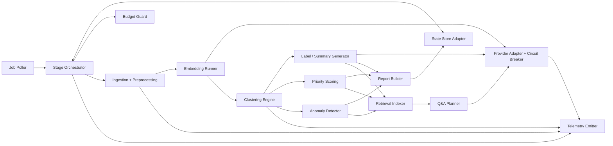

# C4 Component

Диаграмма раскрывает внутреннее устройство ядра системы на уровне компонентов worker/orchestrator.

```mermaid
flowchart LR
    trigger["Job Poller"]
    state["State Store Adapter"]
    orchestrator["Stage Orchestrator"]
    budget["Budget Guard"]
    provider["Provider Adapter + Circuit Breaker"]
    preprocess["Ingestion + Preprocessing"]
    embed["Embedding Runner"]
    cluster["Clustering Engine"]
    label["Label / Summary Generator"]
    score["Priority Scoring"]
    anomaly["Anomaly Detector"]
    indexer["Retrieval Indexer"]
    report["Report Builder"]
    chat["Q&A Planner"]
    telemetry["Telemetry Emitter"]

    trigger --> orchestrator
    orchestrator <--> state
    orchestrator --> budget
    orchestrator --> preprocess
    preprocess --> embed
    embed --> provider
    embed --> cluster
    cluster --> label
    label --> provider
    cluster --> score
    cluster --> anomaly
    score --> report
    anomaly --> report
    label --> report
    label --> indexer
    score --> indexer
    anomaly --> indexer
    indexer --> chat
    report --> state
    chat --> provider
    orchestrator --> telemetry
    provider --> telemetry
    preprocess --> telemetry
    cluster --> telemetry
```
