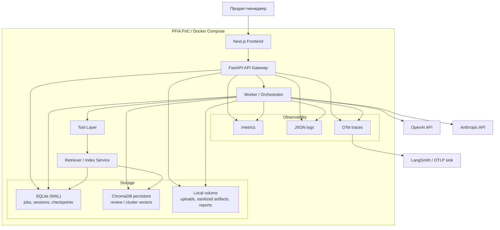

# C4 Container

Диаграмма фиксирует контейнеры и крупные технологические блоки внутри single-node PoC.

```mermaid
flowchart TB
    user["Продакт-менеджер"]

    subgraph pfia["PFIA PoC / Docker Compose"]
        ui["Next.js Frontend"]
        api["FastAPI API Gateway"]
        worker["Worker / Orchestrator"]
        tool["Tool Layer"]
        retr["Retriever / Index Service"]

        subgraph storage["Storage"]
            sql["SQLite (WAL)<br/>jobs, sessions, checkpoints"]
            chroma["ChromaDB persistent<br/>review / cluster vectors"]
            files["Local volume<br/>uploads, sanitized artifacts, reports"]
        end

        subgraph observability["Observability"]
            metrics["/metrics"]
            logs["JSON logs"]
            traces["OTel traces"]
        end
    end

    openai["OpenAI API"]
    anthropic["Anthropic API"]
    langsmith["LangSmith / OTLP sink"]

    user --> ui
    ui --> api
    api --> sql
    api --> files
    api --> worker
    worker --> sql
    worker --> files
    worker --> chroma
    worker --> tool
    tool --> retr
    retr --> chroma
    retr --> sql
    worker --> openai
    worker --> anthropic
    api --> metrics
    worker --> metrics
    api --> logs
    worker --> logs
    api --> traces
    worker --> traces
    traces --> langsmith
```
