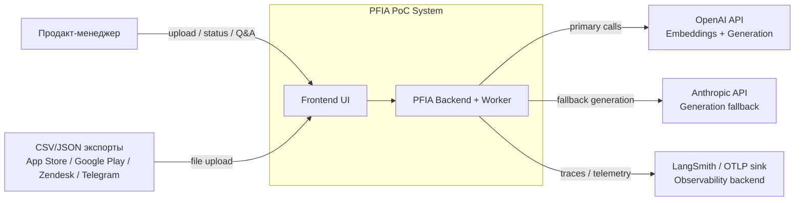

# C4 Context

Диаграмма показывает границы PFIA PoC, внешних акторов и сервисы, от которых зависит система.

```mermaid
flowchart LR
    user["Продакт-менеджер"]
    exports["CSV/JSON экспорты<br/>App Store / Google Play / Zendesk / Telegram"]

    subgraph pfia["PFIA PoC System"]
        ui["Frontend UI"]
        core["PFIA Backend + Worker"]
    end

    openai["OpenAI API<br/>Embeddings + Generation"]
    anthropic["Anthropic API<br/>Generation fallback"]
    obs["LangSmith / OTLP sink<br/>Observability backend"]

    user -->|upload / status / Q&A| ui
    exports -->|file upload| ui
    ui --> core
    core -->|primary calls| openai
    core -->|fallback generation| anthropic
    core -->|traces / telemetry| obs
```
