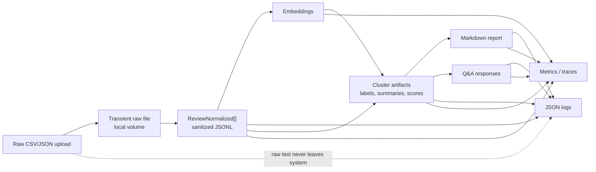

# Data Flow

Диаграмма показывает, какие данные проходят через систему, что хранится и что логируется.

```mermaid
flowchart LR
    upload["Raw CSV/JSON upload"]
    raw["Transient raw file<br/>local volume"]
    normalized["ReviewNormalized[]<br/>sanitized JSONL"]
    vectors["Embeddings"]
    clusters["Cluster artifacts<br/>labels, summaries, scores"]
    report["Markdown report"]
    chat["Q&A responses"]
    logs["JSON logs"]
    metrics["Metrics / traces"]

    upload --> raw
    raw --> normalized
    normalized --> vectors
    normalized --> logs
    vectors --> clusters
    normalized --> clusters
    clusters --> report
    clusters --> chat
    clusters --> logs
    report --> logs
    chat --> logs
    upload -. raw text never leaves system .-> logs
    normalized --> metrics
    vectors --> metrics
    clusters --> metrics
    report --> metrics
    chat --> metrics
```
