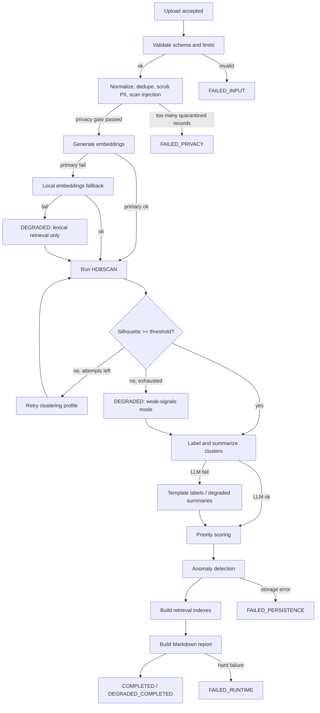

# Workflow / Graph

Диаграмма показывает пошаговое выполнение batch-запроса и основные ветки ошибок.

```mermaid
flowchart TD
    start["Upload accepted"] --> validate["Validate schema and limits"]

    validate -->|ok| preprocess["Normalize, dedupe, scrub PII, scan injection"]
    validate -->|invalid| fail_input["FAILED_INPUT"]

    preprocess -->|privacy gate passed| embed["Generate embeddings"]
    preprocess -->|too many quarantined records| fail_privacy["FAILED_PRIVACY"]

    embed -->|primary ok| cluster["Run HDBSCAN"]
    embed -->|primary fail| embed_fallback["Local embeddings fallback"]
    embed_fallback -->|ok| cluster
    embed_fallback -->|fail| degraded_lex["DEGRADED: lexical retrieval only"]
    degraded_lex --> cluster

    cluster --> quality{"Silhouette >= threshold?"}
    quality -->|yes| label["Label and summarize clusters"]
    quality -->|no, attempts left| cluster_retry["Retry clustering profile"]
    cluster_retry --> cluster
    quality -->|no, exhausted| weak["DEGRADED: weak-signals mode"]
    weak --> label

    label -->|LLM ok| score["Priority scoring"]
    label -->|LLM fail| label_fallback["Template labels / degraded summaries"]
    label_fallback --> score

    score --> anomaly["Anomaly detection"]
    anomaly --> index["Build retrieval indexes"]
    index --> report["Build Markdown report"]
    report --> complete["COMPLETED / DEGRADED_COMPLETED"]

    anomaly -->|storage error| fail_storage["FAILED_PERSISTENCE"]
    report -->|hard failure| fail_runtime["FAILED_RUNTIME"]
```
